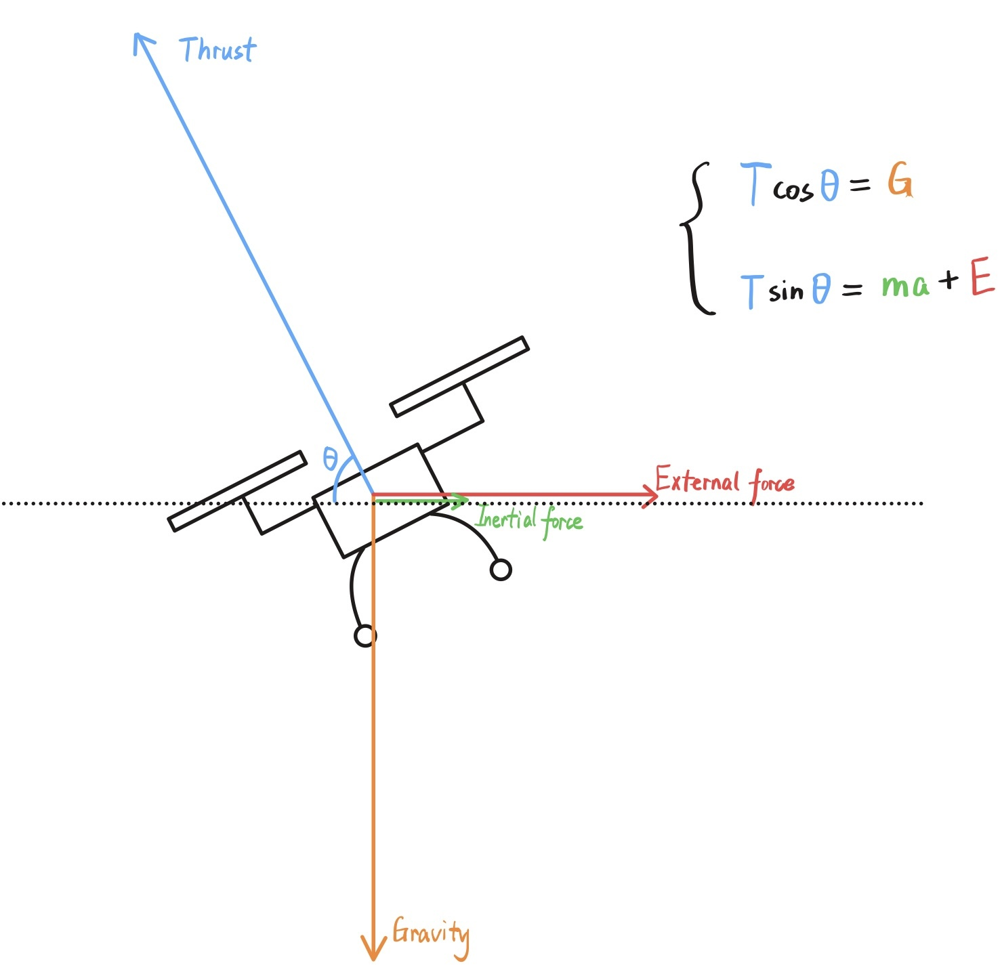
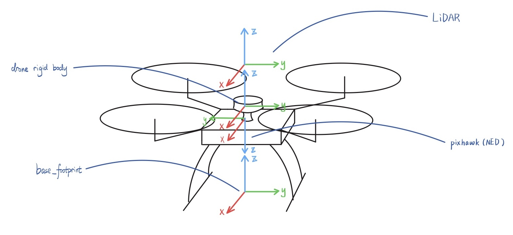
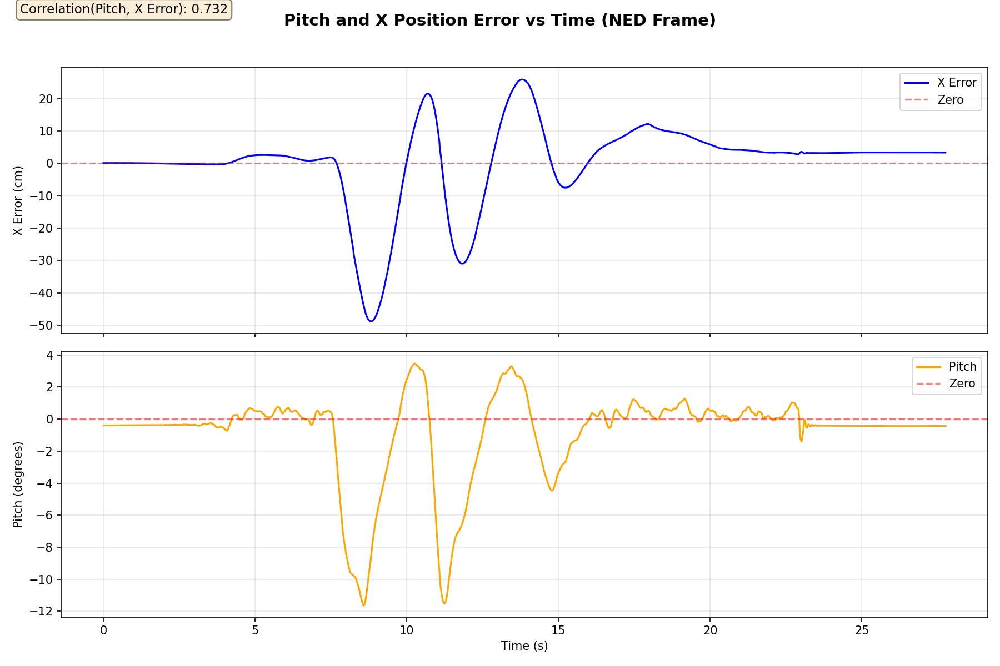

# Force-Compliant Drone with Obstacle Avoidance

A quadrotor that moves in the direction of applied external forces — drag it, and it follows. A Kalman filter estimates the force from position observations alone, and an LiDAR-based potential field prevents collisions while preserving the intended direction of motion.

---

## Demo

### Force Compliance + Obstacle Avoidance

[](https://www.youtube.com/watch?v=fADfVLkpe30)

### Force Compliance Only

[](https://www.youtube.com/shorts/PKJpDcvVS8U)

---

## How It Works

The drone stays still when no force is applied. Push it in any horizontal direction, and it accelerates in that direction at a speed proportional to force magnitude. Release it, and it decelerates to a position hold. With obstacle avoidance enabled, the drone steers around obstacles automatically while the pilot continues to apply force in the desired direction.

**Behaviors:**
- Hover in place with no input
- Translate in the direction and at the speed implied by applied force
- Decelerate and hold position when force is released
- Repel from nearby obstacles using 2D LiDAR (directional hemicircle + omnidirectional safety bubble)

---

## Mathematical Model

### Force Decomposition

A tilted quadrotor that is not accelerating horizontally must be experiencing an external horizontal force. This is the core insight that makes sensorless force estimation possible.



At quasi-steady-state, the force balance gives:
- **Vertical:** `T·sin(θ) = G` — vertical thrust equals gravity
- **Horizontal:** `T·cos(θ) = m·a + E` — horizontal thrust overcomes inertia and external force E

By observing position through OptiTrack and knowing the thrust command, any residual horizontal acceleration is attributed to an external force.

### Frame Conventions

The system uses four coordinate frames, all visible on the physical drone:



| Frame | Convention | Role |
|-------|------------|------|
| **Pixhawk** | NED — X=North, Y=East, Z=Down | PX4 internal state, trajectory setpoints |
| **Drone rigid body** (`imu_link`) | FLU — X=Forward, Y=Left, Z=Up | OptiTrack tracking frame; KF position observations |
| **base_footprint** | FLU — X=Forward, Y=Left, Z=Up | Ground-projected drone pose in the TF tree |
| **LiDAR** (`laser`) | FLU — X=Forward, Y=Left, Z=Up | 2D scan frame; rigidly aligned with body (no rotation) |

All ROS frames use FLU. Only the Pixhawk uses NED. Conversion chain (body FLU → NED), using yaw ψ:
```
FLU → FRD:  x_frd =  x_flu,   y_frd = -y_flu
FRD → NED:  x_ned =  cos(ψ)·x_frd + sin(ψ)·y_frd
            y_ned = -sin(ψ)·x_frd + cos(ψ)·y_frd
```

### Attitude Encodes Horizontal Force

Because PX4 produces horizontal motion by tilting the drone, pitch and roll are direct observations of horizontal force. This validates the model and motivates using attitude in the Kalman filter's control input term.

**Pitch correlates with X position error (NED):**



Correlation = 0.732. Pitch tracks the X-axis error, confirming the model: when the drone is pushed forward, PX4 pitches nose-down to accelerate, producing a position error that grows until it matches the commanded velocity.

**Roll correlates with Y position error (NED):**


Correlation = −0.777 (negative due to the FRD→NED sign convention). Roll tracks Y-axis error with the expected sign flip, consistent with the frame rotation.

---

## Kalman Filter Force Estimator

The KF estimates `[px, vx, py, vy, Fx, Fy]` in the NED world frame using only OptiTrack position observations at 50 Hz.

**State transition:**
```
px ← px + vx·dt
vx ← vx + (Fx/m)·dt + Bu_x
py ← py + vy·dt
vy ← vy + (Fy/m)·dt + Bu_y
Fx ← Fx   (modeled as random walk)
Fy ← Fy
```

**Control input Bu** — the NED horizontal acceleration produced by thrust, accounting for the full roll/pitch/yaw rotation:
```
Bu_x = -(T/m)·[cos(ψ)·sin(θ)·cos(φ) + sin(ψ)·sin(φ)] · dt
Bu_y = -(T/m)·[sin(ψ)·sin(θ)·cos(φ) - cos(ψ)·sin(φ)] · dt
```
Thrust magnitude: `T = m·g / (cos(φ)·cos(θ))`, so the vertical component always equals gravity regardless of tilt.

**Observation:** OptiTrack 2D position `[px, py]`. The filter converges in ~1 second from hover and continues tracking slowly varying external forces.

The estimated `[Fx, Fy]` drives the velocity setpoint. Obstacle repulsion forces are added to `F_cmd` *after* estimation and never feed back into the KF.

---

## Obstacle Avoidance

Repulsive forces from the RPLidar scan are superimposed on the estimated external force using a potential field approach.


The diagram shows the full force superposition: the orange arc is the hemicircle detection zone facing F_ext (red). Obstacles inside generate avoidance forces (teal and purple arrows) pushing the drone away. Velocity damping (pink) opposes the current velocity when repulsion is active. The command force (blue dashed) is the vector sum of all contributions.

### Two-Pass Scan Processing

**Pass 1 — Hemicircle (directional):**
Scans a ±90° cone in the direction of F\_ext (the orange arc), up to a radius that scales with force magnitude (`hemicircle_radius_base + hemicircle_radius_gain × |F_ext|`). Ensures obstacles in the intended direction of travel are detected well in advance.

**Pass 2 — Omnidirectional safety bubble:**
Scans the full 360° for obstacles within a fixed close-range radius (`omni_obstacle_distance`, default 0.5 m). Catches side and rear obstacles when the drone sidesteps away from a front obstacle — preventing blind-spot collisions.

Both passes accumulate into the same repulsion vector. Overlap near the drone (very close front obstacles) is intentional and produces stronger repulsion exactly where it is needed most.

### Force Superposition

```
F_cmd = F_ext + F_rep + F_damp
```

- **F\_ext** — estimated external force from the Kalman filter (red arrow)
- **F\_rep** = Σ k/d² toward the drone, from all detected obstacles (teal/purple arrows, clamped to `max_repulsion_force`)
- **F\_damp** = −`obstacle_velocity_damping` × (|F\_rep| / max\_rep) × v\_cmd (pink arrow, opposes velocity)

The damping term is zero when no obstacles are near and grows proportionally as the drone enters the repulsion field. This prevents the growing oscillations that occur when the drone is caught between two close obstacles.

---

## Hardware

| Component | Model | Role |
|-----------|-------|------|
| Frame | Holybro X500 V2 | Quadrotor platform |
| Flight Controller | Pixhawk 6C | PX4 autopilot, attitude and rate control |
| Companion Computer | Raspberry Pi 5 | uXRCE-DDS bridge over UART |
| Motion Capture | OptiTrack | 6-DoF position at 120 Hz |
| LiDAR | SLAMTEC RPLidar | 2D scan, 360°, ~8 m range |

**Communication chain:**
```
OptiTrack → Laptop (ROS 2) ──WiFi──► Raspberry Pi ──UART (921600 baud)──► Pixhawk (PX4)
```

---

## Software Stack

| Layer | Technology |
|-------|------------|
| OS | Ubuntu 24.04 (RPi), Linux (Laptop) |
| ROS 2 | Jazzy (RPi), Kilted (Laptop) |
| Autopilot | PX4 |
| DDS Bridge | uXRCE-DDS Agent |
| Localization | OptiTrack Motive + TF2 |
| Force Estimator | Custom KF (Eigen) in ROS 2 node |
| Obstacle Avoidance | Potential field on LaserScan |

---

## Repository Structure

```
src/
├── mycode/
│   ├── offboard_test/              # Main control package
│   │   ├── src/
│   │   │   ├── force_drive_node.cpp      # KF estimator + velocity controller + avoidance
│   │   │   └── vision_bridge_node.cpp    # OptiTrack TF → PX4 VehicleOdometry
│   │   └── launch/offboard_test.launch.xml
│   ├── drone_description/          # URDF model and meshes (X500 V2)
│   └── drone_viz/                  # Arena markers, RViz config
├── optitrack/                      # NatNet client → ROS 2 TF publisher
├── sllidar_ros2/                   # RPLidar ROS 2 driver
├── px4_msgs/                       # PX4 message definitions
└── images/                         # Diagrams and plots
```

---

## Quick Start

**Prerequisites:** ROS 2 installed, OptiTrack Motive running, RPi reachable on the network.

```bash
# Build
cd ~/winter_project/code
colcon build

# Source
source install/setup.bash

# Preflight: restart DDS agent on RPi and verify PX4 topics are visible
./src/mycode/offboard_test/scripts/preflight.sh

# Launch everything (OptiTrack, visualization, vision bridge, force drive node)
ros2 launch offboard_test offboard_test.launch.xml

# Start LiDAR on RPi (This project uses RPLiDAR C1M1-R2)
ros2 launch sllidar_ros2 sllidar_c1_launch.py
```

### Key Parameters (`offboard_test.launch.xml`)

| Parameter | Default | Description |
|-----------|---------|-------------|
| `force_deadzone` | 0.5 N | Minimum force magnitude to leave hover |
| `velocity_gain` | 0.5 m/s/N | Speed per unit of estimated force |
| `max_velocity` | 1.0 m/s | Speed cap |
| `repulsion_gain` | 0.1 | Obstacle repulsion strength (k in k/d²) |
| `hemicircle_radius_base` | 0.7 m | Forward detection radius at zero force |
| `hemicircle_radius_gain` | 0.2 m/N | How much the hemicircle grows with force |
| `omni_obstacle_distance` | 0.5 m | Radius of the 360° safety bubble |
| `max_repulsion_force` | 3.0 N | Maximum total repulsion force |
| `obstacle_velocity_damping` | 2.0 | Damping strength between close obstacles |
